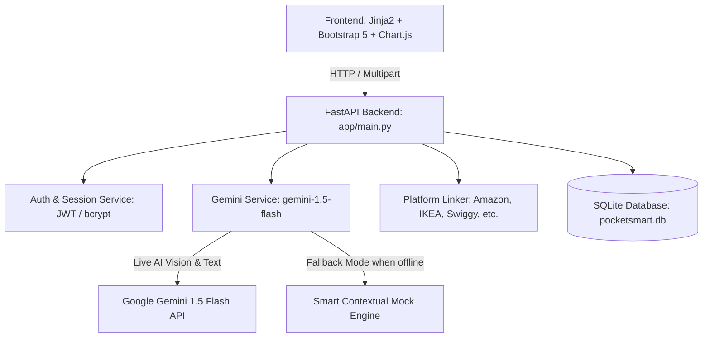

# PocketSmart AI: Your Smart Budget & Recommendation Assistant 🛍️🏠🎉💎

**PocketSmart AI** is a production-grade, GenAI-powered lifestyle budget planning and cross-platform recommendation system. Built with **FastAPI**, **Google Gemini 1.5 Flash (Multimodal)**, **SQLite / SQLAlchemy**, and interactive **Jinja2 & Chart.js** frontends, it takes the guesswork out of lifestyle budgeting.

Whether you are decorating an apartment, hosting an event, or styling jewelry for a festive occasion, PocketSmart AI calculates optimal allocations and sources verified options directly from platforms like **Amazon, Flipkart, IKEA, Swiggy, Zomato, and OYO**.

---

## 🌟 Core Scenarios & Features

### 1. Home Interior Budget Planner 🛋️
- **Input**: Total budget, room type (Living Room, Bedroom, Modular Kitchen, etc.), priority item checkboxes (Sofa, Lighting, Rugs, Decor, Shelves), and interior style theme (Modern Minimalist, Scandinavian, Bohemian, Industrial).
- **Output**: 
  - Visual budget distribution donut chart (Furniture 50%, Lighting 20%, Decor 18%, Storage 12%).
  - Curated product cards with estimated prices and direct search links to **IKEA, Amazon, and Flipkart**.
  - Actionable Gemini AI interior design and space-planning tips.

### 2. Party & Event Budget Planner 🥂
- **Input**: Total budget, expected guest count, event type (Birthday, Wedding, Housewarming, Reunion), venue preference (Home, OYO Suite, Banquet Hall), and catering style.
- **Output**:
  - Per-guest cost estimation (`₹/person`).
  - Budget split across Food & Catering, Venue & Space, Decoration & Ambience, and Entertainment.
  - Sourced vendor recommendations linking to **Swiggy, Zomato, OYO Rooms, and Amazon**.

### 3. Jewelry Vision Planner (Multimodal) 💎📷
- **Input**: Budget, occasion (Wedding, Festive Diwali, Cocktail Party, Daily Wear), metal preference (Gold, Antique Brass, Rose Gold, Silver), and an **optional photo upload of your outfit**.
- **Output**:
  - **Gemini Vision Analysis**: Automatically identifies fabric color palette, neckline cut (sweetheart, V-neck, collar), and recommends matching jewelry tones.
  - Curated pieces (choker necklace, drop earrings, bangles, rings) from **CaratLane, Amazon, Flipkart, and Tanishq**.

### 4. Authentication, History & Dashboard 📊
- User registration and login with secure **bcrypt** password hashing and **JWT** session cookies.
- Personal **Dashboard** tracking total plans created, total budget managed, and recent queries.
- **Saved History** with category filtering and detailed re-inspection views.
- **Community Testimonials** wall with an interactive feedback submission form.

---

## 🏗️ Architecture & Tech Stack



- **Backend**: FastAPI 0.110+, Uvicorn
- **AI / LLM**: Google Gemini 1.5 Flash (`google-generativeai`) with multimodal vision
- **Database**: SQLite with SQLAlchemy ORM
- **Authentication**: JWT (`python-jose`), Passwords (`bcrypt`)
- **Frontend**: HTML5, CSS3, Bootstrap 5.3, FontAwesome 6, Chart.js 4, Jinja2
- **Testing**: Pytest, HTTPX

---

## 📁 Project Directory Structure

```
pocketsmartai/
│── app/
│   │── __init__.py
│   │── main.py                   # FastAPI app entrypoint, CORS, static & router mounts
│   │── config.py                 # Configuration & environment settings
│   │── database.py               # SQLAlchemy database setup & session generator
│   │── models/
│   │   │── __init__.py
│   │   │── user.py               # User DB model
│   │   │── recommendation.py     # RecommendationHistory & Testimonial DB models
│   │   │── schemas.py            # Pydantic schemas for inputs and responses
│   │── routes/
│   │   │── __init__.py
│   │   │── auth.py               # /login, /register, /logout, /token
│   │   │── home_planner.py       # /home-planner, /generate-home
│   │   │── party_planner.py      # /party-planner, /generate-party
│   │   │── jewelry_planner.py    # /jewelry-planner, /generate-jewelry (multimodal)
│   │   │── history.py            # /, /dashboard, /history, /testimonials
│   │   │── api.py                # /session-info, /session-data, /recommendations-details
│   │── services/
│   │   │── __init__.py
│   │   │── gemini_service.py     # Gemini 1.5 Flash API calls, vision & fallback mock engine
│   │   │── platform_linker.py    # E-commerce platform search URLs generator
│   │   │── auth_service.py       # bcrypt hashing, JWT issuance & verification
│   │── templates/
│   │   │── base.html             # Base layout with navbar, footer & loading overlay
│   │   │── index.html            # Landing page
│   │   │── login.html            # Sign-in form
│   │   │── register.html         # User registration
│   │   │── dashboard.html        # User analytics dashboard
│   │   │── home_planner.html     # Home interior form
│   │   │── home_recommendations.html # Home results + budget chart
│   │   │── party_planner.html    # Party planner form
│   │   │── party_recommendations.html# Party results + budget chart
│   │   │── jewelry_planner.html  # Jewelry planner form + drag-and-drop outfit upload
│   │   │── jewelry_recommendations.html # Jewelry results + color palette analysis
│   │   │── history.html          # Saved recommendations list
│   │   │── recommendation_details.html # Past recommendation detailed inspection
│   │   │── testimonials.html     # Community testimonials & submission form
│   │── static/
│       │── css/styles.css        # Custom CSS styling
│       │── js/main.js            # Image upload preview, loading overlays
│       │── js/charts.js          # Chart.js donut chart initializer
│       │── uploads/              # Storage directory for uploaded outfit images
│── tests/
│   │── __init__.py
│   │── test_auth.py              # Auth & registration tests
│   │── test_planners.py          # Planner endpoints & API tests
│   │── test_gemini.py            # Platform linker & fallback budget integrity tests
│── .env.example                  # Environment configuration template
│── .env                          # Local environment file
│── requirements.txt              # Complete Python dependencies
│── run.py                        # Python server launcher
│── README.md                     # Documentation & setup guide
```

---

## 💻 Simple VS Code Setup & Installation Guide

Follow these simple steps to run PocketSmart AI on your local Windows / macOS / Linux machine using VS Code:

### Step 1: Open the Project in VS Code
1. Launch **Visual Studio Code**.
2. Go to **File** ➔ **Open Folder...** and select `c:\Users\rohid\OneDrive\Desktop\pocketsmartai`.
3. Recommended VS Code extensions (optional but helpful):
   - **Python** (by Microsoft)
   - **Pylance** (by Microsoft)

### Step 2: Open a Terminal & Create Virtual Environment
Open the integrated terminal in VS Code (`Ctrl + ~` or **Terminal** ➔ **New Terminal**):

```powershell
# 1. Create a Python virtual environment
python -m venv venv

# 2. Activate the virtual environment
# On Windows PowerShell:
.\venv\Scripts\Activate.ps1
# (Or on Command Prompt: .\venv\Scripts\activate.bat)
# (On macOS/Linux: source venv/bin/activate)

# 3. Install all dependencies
pip install -r requirements.txt
```

### Step 3: Configure Environment Variables
A default `.env` file is already created. To connect your Google Gemini API:
1. Open `.env` in VS Code.
2. Get your free Gemini API key from [Google AI Studio](https://aistudio.google.com/app/apikey).
3. Paste it into the `GEMINI_API_KEY` field:
   ```env
   GEMINI_API_KEY=your_actual_gemini_api_key_here
   GEMINI_MODEL=gemini-1.5-flash
   ```
> **Note**: If you don't add a key right away, **PocketSmart AI automatically runs in Fallback Demo Mode**. You can explore and test every feature, form, chart, and platform link immediately without an API key!

---

## 🚀 Running the Application

In your activated terminal, execute:

```powershell
python run.py
```

*Or run directly with uvicorn:*
```powershell
uvicorn app.main:app --reload --port 8000
```

Now open your web browser and navigate to:
👉 **[http://127.0.0.1:8000](http://127.0.0.1:8000)**

---

## 🧪 Running Automated Tests

To verify all authentication, recommendation endpoints, platform link generators, and AI fallback logic, run:

```powershell
pytest -v
```

All test cases will run and validate endpoint responses, database persistence, and budget integrity.

---

## 🌐 Key API Endpoints

| Endpoint | Method | Description |
| :--- | :--- | :--- |
| `/` | `GET` | Main Landing Page |
| `/login` | `GET`, `POST` | User authentication & session cookie issuance |
| `/register` | `GET`, `POST` | New user account creation |
| `/logout` | `GET` | Terminate session and clear cookie |
| `/home-planner` | `GET` | Home Interior Planner input form |
| `/generate-home` | `POST` | Process home decor budget & return recommendations |
| `/party-planner` | `GET` | Party Budget Planner input form |
| `/generate-party` | `POST` | Process event budget & return recommendations |
| `/jewelry-planner` | `GET` | Multimodal Jewelry Planner with outfit upload |
| `/generate-jewelry` | `POST` | Process outfit image & style for jewelry suggestions |
| `/dashboard` | `GET` | User analytics & recent plans |
| `/history` | `GET` | Query past plans with category filtering |
| `/history/{id}` | `GET` | Detailed review of a saved recommendation |
| `/testimonials` | `GET`, `POST` | Community reviews & feedback submission |
| `/session-info` | `GET` | JSON session metadata & login status |
| `/session-data` | `GET` | JSON user saved queries |
| `/recommendations-details` | `GET` | JSON detailed query by ID |
| `/startup` | `GET` | Health check & Gemini status |
